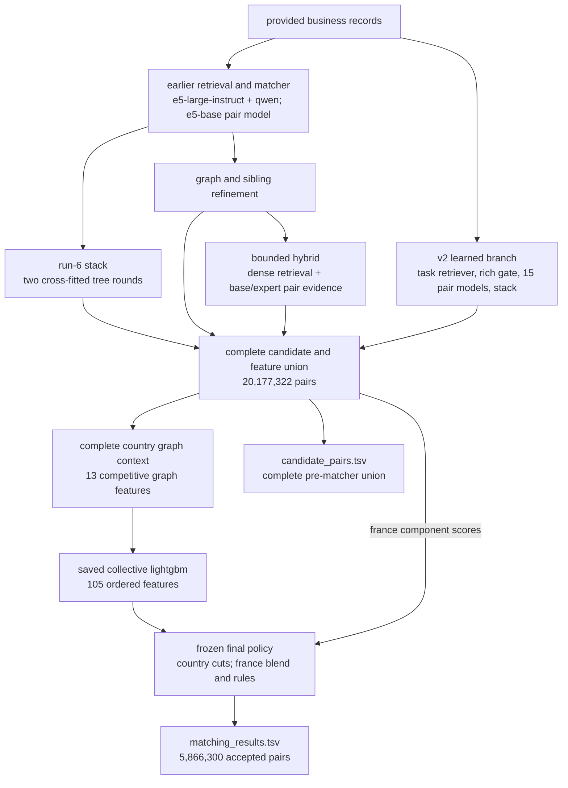
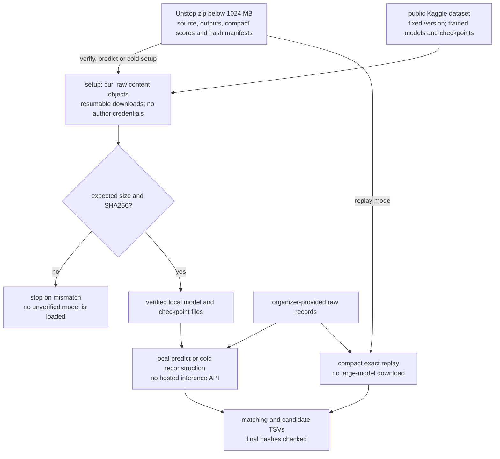

# ml challenge 2026 — business entity resolution

- **team:** amazites
- **members:** varun jhaveri, shivsharan sanjawad, raj mathuria, aastha singh
- **archive variant:** final-france
- **matching pairs:** 5,866,300
- **candidate pairs:** 20,177,322
- **recorded public result:** 0.990285

## 1. executive summary

our system resolves noisy source2/source3 business records against the source1 reference catalog
it combines lexical and multilingual retrieval, a task-trained retriever, a rich candidate gate, independent neural pair scores, complementary tree/graph/hybrid models and a frozen final decision policy

the final policy uses collective probabilities for india/us and an available-score blend for france
the french category-swap filter is common to both releases
the final-france variant adds a narrow positional name rule that removes three pairs
its team-reported public macro f0.5 is 0.990285, compared with 0.990284 for sprint2

the Unstop package stays below 1024 mb and contains the exact submitted matching/candidate files, source implementations, actual late-sprint selection scripts, pinned environments and checksum-bound model manifests
the complete trained weights, tokenizers, preprocessing/calibration state and large reconstruction checkpoints are on Kaggle: https://www.kaggle.com/datasets/cycl0p5/amazites-ml-2026-reproduction-assets/versions/1
the reproduction command automatically fetches missing files with curl and verifies every SHA256 before model use
the trained-head reconstruction and original score replay both reproduce the submitted bytes
the raw-data inference command executes retrieval and the neural/tree/graph/hybrid chain using those fixed, verified checkpoints

## 2. challenge and scoring

each source1 record represents a reference business
the desired output is its complete set of matching source2/source3 ids, or an empty set
a target has one true reference owner or no owner, while one reference may have many aliases across both sources

the score is macro f0.5 over reference businesses:

```text
f0.5 = 1.25 * tp / (1.25 * tp + 0.25 * fn + fp)
```

we retain the complete reference truth denominator during evaluation
the metric makes false merges costly and rewards correctly empty predictions
pairwise accuracy, candidate recall and format validation are therefore insufficient on their own

the organizer also reviews the actual candidate pool
our candidate file includes rejected pairs and is not derived by keeping only accepted matches

## 3. data analysis

| population | references | source2 targets | source3 targets |
| --- | ---: | ---: | ---: |
| train | 2,206,821 | 5,034,616 | 5,285,603 |
| test | 1,732,544 | 4,887,273 | 5,082,316 |

training covers the us and india
test also includes 259,452 france references and 1,434,993 french targets
france has no labeled training counterpart

the input census checked file hashes, unique/valid ids, country populations, missingness, unicode/script properties, url-like names and length distributions
the label audit found 7,638,365 linked training targets, 2,681,854 orphan targets and 123,247 references with no true aliases

raw reference addresses were present in the recorded census, while target addresses were frequently absent or missing-like
many target names were non-ascii or url-like even when the reference name was a plain canonical string
indian reference addresses were substantially longer than us reference addresses at the median

we joined these patterns to model errors
in the early full-pool diagnostic, blank-address records were about 4.4% of linked targets in the slice but accounted for 72.9% of missing pre-matcher links and 83.8% of wrong top-1 outcomes
that evidence drove retrieval and ambiguity work rather than only another classifier search

## 4. preprocessing and identity

the original fields and external ids are preserved
additional comparison views normalize unicode, case, punctuation, legal suffixes, domains, alternate-name markers, initials, transliteration and address tokens

normalization does not automatically imply a match
the feature set retains name multiplicity, rare-token evidence, house-number differences and competing owners
department/address normalization is scoped so that replacing an administrative component does not blindly alter a street name

internally, references and targets use stable row ids
source3 target ids are offset by the source2 count
data/model/cache hashes bind those ids to the original files and their preparation

## 5. blocking and candidate generation

the unrestricted test cartesian product is on the order of seventeen trillion comparisons
we reduce it with complementary retrieval rather than applying the final matcher to every possible pair

the earlier lanes combine lexical name/address retrieval with pinned multilingual encoders
the task-trained small retriever adds challenge-specific alias evidence
reverse reference-to-target retrieval supplies an additional rank signal, including an explicitly scoped blank-address bank

the learned gate uses a 103-input lexical, corpus, generator-aware and dense/rank contract
its selected inference policy keeps a minimum candidate when retrieval has produced any, retains scores above 0.001 and caps the target list at 50
the neural scoring floor is also 0.001

later run-6, graph/sibling and bounded hybrid outputs are joined into the final score union
the hybrid branch uses bounded lexical-name/address and dense-name/address lanes, with reciprocal-rank fusion and preserved parent candidates

the final candidate population has 20,177,322 pairs
per-reference candidate counts have mean 11.6461, median 10, p95 23, p99 48 and maximum 9,807
25 references have no candidates and still appear in both output files

## 6. retrieval and pair-model training

the task retriever starts from multilingual-e5-small and uses symmetric name/address query text, masked mean pooling and normalized embeddings
its recorded run uses a 64,000-pair warm start followed by a requested 1.5-million-pair pass; the latter processed 1,499,968 pairs
activation checkpointing supported the local low-memory gpu run

the full cross-encoder preparation creates five fixed three-million-pair hard datasets with roughly 2.08 million positives each
positive links are restored before capping, and validation separates reference/true-owner groups

cross-encoders use jointly tokenized record pairs, a mean-pooled classification head, frozen input embeddings, binary cross-entropy, adamw, warm-up/cosine scheduling, mixed precision and gradient clipping
distributed workers use explicit devices and length-bucketed batches
the main comparisons hold global batch at 80 while varying family, seed, learning rate and token limit

the selected learned ensemble includes e5-small, e5-base, e5-large-instruct and bge-reranker-v2-m3 runs
fifteen complete-epoch members were selected; an interrupted bge checkpoint is excluded
ensemble aggregation is mean logit followed by sigmoid, with individual member probabilities retained for the later stack

model identities, revisions, licenses and per-member configurations are included under the source project's `configs/` and model-source records
the actual neural inference inventory is:

| model/checkpoint | role | parameters |
| --- | --- | ---: |
| multilingual-e5-large-instruct pair models ×6 | v2 matcher | 6 × 558,841,857 |
| bge-reranker-v2-m3 ×3 | v2 matcher | 3 × 566,706,177 |
| multilingual-e5-base pair models ×4 | v2 matcher | 4 × 277,453,825 |
| multilingual-e5-small pair models ×2 | v2 matcher | 2 × 117,506,305 |
| **v2 matching ensemble** | **15 selected checkpoints** | **6,397,997,583** |
| task-trained multilingual-e5-small | v2 candidates | 117,653,760 |
| frozen multilingual-e5-base | hybrid dense retrieval/features | 278,043,648 |
| earlier fine-tuned e5-base matcher | earlier scores; reused in hybrid | 278,044,417 |
| Qwen3-Embedding-0.6B | earlier candidates | 595,776,512 |
| frozen multilingual-e5-large-instruct | earlier candidates | 559,890,432 |
| fine-tuned multilingual-e5-large expert | hybrid pair feature | 558,841,857 |
| **complete neural inference total** | **21 distinct checkpoints** | **8,786,248,209 (8.786B)** |

**the organizer's 8B limit is per model, not the aggregate pipeline**
our largest individual checkpoint is **595,776,512 parameters (approximately 0.596B)**, so the 8.786B combined neural total is consistent with that per-model rule
the models retain their original MIT/Apache-2.0 licenses, run locally after checkpoint download, and are fine-tuned only on the provided data
the same earlier pair model is reused across branches and counted once; buffer tensors, non-neural trees/rules and training-only initializers are excluded from this neural total
the v2 ensemble plus its task retriever is the smaller **6,515,651,343 (6.516B)** subtotal
the checkpoint-hash-bound inventory and recounting command are provided in `code/business_entity_resolution/docs/models.md`

## 7. learned feature and fusion layers

the rich learned pair stack combines raw-text/corpus features, generator-aware name/number features, gate/neural logits and retained member logits
its selected configuration has 101 inputs
it excludes unavailable original retrieval columns instead of filling them with misleading placeholders

the complementary run-6 stack fits cross-fitted rounds and adds confident-sibling evidence
the graph/sibling refinement supplies a learned `head` score
the bounded hybrid fits residual logits around its parent using weighted owner-group partitions and separately records new candidate pairs

full fusion uses a full outer join of the score sources
missing scores have explicit presence indicators
features include score disagreement, complete target competition, name/token overlap, legal-form position, name multiplicities, address/street overlap and house-number evidence

residual fusion learns around the newest stack's logit
the collective model adds deterministic graph features to this complete score representation

## 8. collective graph implementation

the collective graph connects source2/source3 targets within a country using normalized-name or strict-address blocks
blocks larger than 16 are excluded; edges require compatible house evidence and exact-name or sufficiently similar same-address evidence
only reciprocal top-four neighbors survive

candidate-owner odds compete with a unit null state
three damped cavity-message rounds preserve unsent rival odds in the denominator, remove reverse-edge self-reinforcement, and require at least two original confident neighbors for positive reinforcement

the implementation produces thirteen graph features, including owner/null posteriors, entropy, margins, neighbor support and logit shifts
the final collective lightgbm fit uses 105 features
the graph does not add reference-target pairs

the recorded test graph has 2,686,360 directed reciprocal edges and 2,628,882 directed owner messages
1,750,828 targets have reciprocal neighbors
the recorded workload does not trigger the 40-million-row message-budget fallback

## 9. azure execution and reusable artifacts

we separated gpu representation/pair work from cpu population features, tree fitting, calibration and export

| resource class | role |
| --- | --- |
| local 12-thread workstation with a 6 gib gpu | eda, compact retrieval training, small checks and sequential final replay |
| `Standard_NC24ads_A100_v4` | single-a100 work and small pair-model fits |
| `Standard_NC96ads_A100_v4` | four-a100 distributed pair training, gate/reverse work and multi-gpu scoring |
| `Standard_E64ds_v4` | large-memory full-population features, graph/fusion fits and cpu searches |
| `Standard_E16ds_v4` | final country/blend policy and output passes |

the main training envelope requested 1,488 vcpus / 62 a100s across a gate job and sixteen cross-encoder configurations
shared model/data assets were staged once and reused by immutable location
full learned scoring used sixteen disjoint assignments and verified coverage of all 20,289,808 train/test targets

we retained per-member probabilities, complete score tables, feature matrices, normalizers, fitted heads and selected policies
that made later cpu experiments possible without repeated neural inference

observed startup, unavailable-device, upload-race, memory and trial-storage issues were handled with explicit manifests, real-data smoke checks, retryable ownership, bounded local replay and journal-backed parallel search
the execution guide gives the full matrix, environment and sharding details

## 10. validation protocol and caveats

initial neural fitting uses entity-grouped training identities
the rich stack uses deterministic fitting, search/calibration and development reference partitions
true alias degrees and all competing candidate owners remain visible to the relevant metric

the newer fusion and collective stages build their context on the complete candidate population before selecting new-head fitting/check references
the inherited run-6 code has a documented later-sibling projection caveat
the exact inherited score artifacts are retained; its score impact is not presented as a known correction

the collective new-head protocol groups normalized names and excludes fitting/calibration target overlap with its check population
it still records historical upstream exposure
these checks are not described as a pristine end-to-end holdout

## 11. final country and france decisions

every target selects one reference owner with deterministic tie-breaking
india uses collective-score cut 0.9310117959976196 and the us uses 0.9249221086502075

france uses an available-score arithmetic blend of learned stack, run-6, sibling graph and collective probabilities, with weights 2, 1, 1 and 16
missing inputs are excluded from both numerator and denominator
the french cut is 0.8345136046409607

the shared category-swap filter uses the original run-3 french candidate pool
it drops a same-house, one-word substitution when the swap/reverse support totals at least 20 and the selected direction contributes less than 70%
this is a candidate-derived pattern hypothesis, not labeled france truth

the final-france variant additionally drops pairs whose only added core token is `groupe` immediately before a recognized legal suffix, with the required reference legal-form condition
after-suffix aliases remain eligible
the resulting change is exactly three accepted pairs

## 12. measured progression and lessons

| result | value | interpretation |
| --- | ---: | --- |
| early baseline public | 0.964 | original production checkpoint |
| upgraded-v1 public | 0.969 | early richer retrieval/gate configuration |
| overnight logistic audit | 0.978689 vs 0.975874 | one-time same-pool offline comparison |
| rich tuned-stack development | 0.984547 | labeled-country development |
| learned-stack development | 0.990354 | same 73,752-reference comparison |
| first learned public | 0.986416 | actual public result with its recorded france route |
| collective new-head check | 0.992280 vs 0.991336 | conditional, historically exposed upstream scores |
| combined input public | 0.989926 | starting artifact for the final policy sprint |
| sprint1 public | 0.990108 | late decision-layer change |
| sprint2 public | 0.990284 | recorded final measured release |
| final-france positional edit | 0.990285 | team-reported final submission; exact three-pair derivative |

the task retriever improved full-reference top-50 recall, especially for blank-address india
adaptive gate selection then preserved more of those links
the strong learned development score and weaker first learned public result led us to inspect country routing and transfer behavior
the final sprint crossed 0.99 by using the combined evidence and final country/france policy

the separate 2,560-trial rich-stack finalist was not a new global submitted replacement
failed edit-channel and four-view experiments remain documented without being promoted into the final execution path

## 13. reproduction and integrity

from the extracted source project, install `requirements.txt` in an isolated environment and run `src/finish.py` with the original raw test files and a new output directory
the active `configs/release.json` selects this archive's policy

the replay verifies data and score fingerprints, applies the frozen decisions, restores external ids, writes every required reference row and checks both submitted output hashes
the final-france replay was also verified from raw challenge inputs

strict and supplied-validator checks cover ids, row coverage, target ownership and candidate membership
the integrated fusion test suite passed 395 tests with one skipped
source-style comparison covered operations, literals and public interfaces for 325 imported and 37 existing python files
the archive builder verifies every member's hash and crc before publishing a zip

## 14. detailed reading map

within `code/business_entity_resolution/docs/`:

- `qa.md` maps reviewer questions to source and evidence
- `arch.md` describes each implemented stage, feature group and decision contract
- `compute.md` records azure machines, training allocation, workers, sharding and recovery
- `pipeline.md` documents full score reconstruction and fitting boundaries
- `research.md` records the eda, literature and decision ledger
- `results.md` separates public results from search, development, candidate-oracle and conditional head measurements
- `reproduce.md` gives exact replay, validation and packaging instructions
- `models.md` records model identities, roles, notices and provenance

france remains unlabeled and historical evaluation reuse is disclosed
the final three-pair edit raises the reported public macro score by 0.000001; no france-only score was reported
these limits are preserved alongside the implementation and artifact evidence

## architecture diagram

<!-- diagram:pipeline -->

<!-- /diagram:pipeline -->

## checkpoint delivery diagram

<!-- diagram:distribution -->

<!-- /diagram:distribution -->
