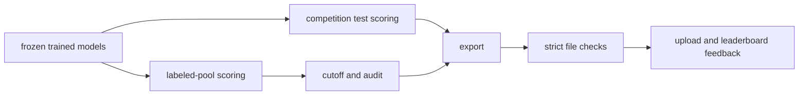
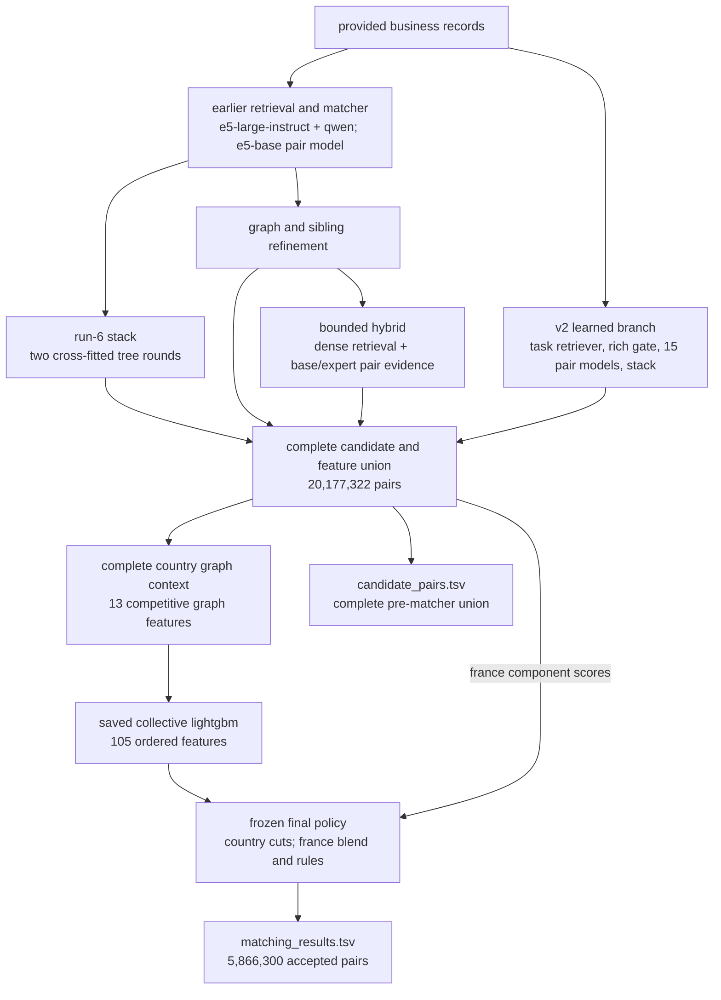
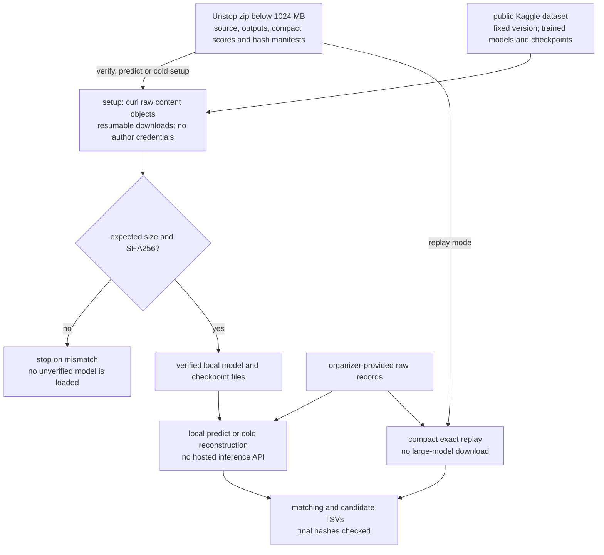

# business entity resolution

our team built a multilingual business-matching pipeline from supplied records, compact candidate sets and calibrated entity-level decisions

**team amazites · best recorded public leaderboard f0.5: 0.990285**

varun jhaveri · shivsharan sanjawad · raj mathuria · aastha singh

## start here for the final submission

this branch's reviewer entry point is the integrated project under [`submission/`](submission/README.md)
read the [q&a and code map](submission/docs/qa.md), then the [final architecture](submission/docs/arch.md), [compute design](submission/docs/compute.md), [full pipeline](submission/docs/pipeline.md) and [exact replay](submission/docs/reproduce.md)
these describe the combined pipeline used for the submitted sprint2 and final-france files
the root `src/` tree and older component notes remain available as development history and supporting tools

## final overview

our final pipeline combines learned retrieval and neural pair scores with run-6, hybrid, residual and collective-graph evidence
the two release variants use frozen country decisions and a france-specific filter
the complete integrated source and reproducible archive layout are in [submission](submission/README.md)
we identified candidate loss, sampled-reference leakage, calibration drift and inconsistent tie-breaking through controlled comparisons
the measured run-level results and reproducibility records are indexed in [status](docs/status.md) and [evidence](reports/README.md)

| variant | retrieval | learned gate | final matcher |
| --- | --- | --- | --- |
| baseline | lexical + e5-base + qwen | original lightgbm/catboost mean | fine-tuned e5 pair classifier |
| upgrade | lexical + e5-base + qwen + e5-large | verified 54-feature lightgbm | fine-tuned e5 pair classifier |
| learned pipeline | lexical + task-trained e5-small + reverse ranks | adaptive 103-feature lightgbm | 15 cross-encoders, 101-feature stack and calibrated set decoding |
| final fusion | union of the learned and earlier score pools | preserved upstream gates | collective graph, country cuts and a frozen france blend |

the learned gate retains probabilities >=0.001, up to 50 candidates per target, with one fallback
the final releases contain **20,177,322 candidate pairs**, averaging **11.6461 per source1 business**
the earlier learned-only export contains 14,146,782 pairs and is retained as a separate checkpoint
all **20,289,808 train/test targets** have saved scores, including all 15 neural member columns
the separate 2,560-trial research search selected a finalist at development macro f0.5 0.990555257; it was not promoted as the released global stack
development measurements and per-archive public results are recorded separately from the final team leaderboard result

## docs

| doc | contents |
| --- | --- |
| [q&a and code map](submission/docs/qa.md) | final execution path, stage ownership, evidence and reviewer questions |
| [final architecture](submission/docs/arch.md) | retrieval, score fusion, collective context and final decisions |
| [final replay](submission/docs/reproduce.md) | deterministic regeneration of the submitted tsvs |
| [full pipeline](submission/docs/pipeline.md) | training and scoring stages that produced the release inputs |
| [azure compute and execution](submission/docs/compute.md) | actual gpu training matrix, cpu stages, worker layout, sharding, caches and recovery |
| [status](docs/status.md) | final team result and checkpoint-specific evidence |
| [evidence](reports/README.md) | measured results and their evaluation scope |
| [research / eda](submission/docs/research.md) | verified data census, primary sources, experiments and decision history |
| [methodology](Documentation_template.md) | team methodology, training and measured results |
| [earlier learned component](docs/learned-submission.md) | historical learned-only archive and its component workflow |
| [team method integration](reports/team-integration.md) | implemented methods, measured development results and reproduction commands |
| [additional findings](reports/additional-workspace-findings.md) | recovered experiment evidence and the sibling-context projection pitfall |
| [final packages](submission/README.md) | sprint2 and final-france archives, exact replay and full pipeline source |

## why infer and validate

**test inference creates the predictions for the competition's unlabeled records**
without those predictions there is no matching file to upload

validation scores known records to choose the acceptance cutoff and check accuracy
it can run at the same time as test inference
export waits for complete test scores and the calibration for that exact model version



## boundaries

- only supplied business records enter the matching pipeline
- no business lookup geocoding external translation services or external data augmentation
- preserve original unicode and use local transliteration as an additional comparison view
- deployed pretrained sources must meet the challenge's model and mit/apache-2.0 licensing requirements
- final output includes every required s1 row, including empty predictions
- every accepted match must occur in its exported candidate set
- export the actual final pre-matcher candidates, including rejected matches
- keep raw records credentials host-specific paths and model/cache binaries out of git

## final release replay

the verified full neural inventory is **8,786,248,209 parameters across 21 distinct checkpoints**
the **8B limit applies per model**, and the largest individual checkpoint is **595,776,512 (approximately 0.596B)**
the [model-wise breakdown](submission/docs/models.md#verified-full-neural-parameter-inventory) explains checkpoint reuse, buffers, licenses and the smaller v2 subtotal

the final-france Unstop zip stays below 1024 mb; trained checkpoints, tokenizers, fitted rules and large stage-resume artifacts are hosted on [Kaggle version 1](https://www.kaggle.com/datasets/cycl0p5/amazites-ml-2026-reproduction-assets/versions/1)
its [complete reproduction guide](submission/docs/reproduce.md) provides automatic checksum-verified fetching, `verify`, trained-model `predict`, full raw-data `cold`, and exact `replay` commands

run from the repository root with the original challenge dataset and the preserved score assets
the final replay uses its own pinned, cpu-only environment

```sh
uv venv --python 3.11.16 .venv-replay
uv pip sync --python .venv-replay/bin/python submission/requirements.txt
.venv-replay/bin/python submission/src/finish.py \
  --data student_resource/dataset --assets artifacts/package-assets \
  --config submission/configs/release.json --out artifacts/qa-replay-sprint2
```

use `submission/configs/final.json` and a new output directory for the final-france variant
the replay checks the original data and score fingerprints, then requires exact equality with the submitted matching and candidate file hashes
the upstream and later fusion stages have different recorded fitting protocols; see [q&a](submission/docs/qa.md#12-how-were-leakage-and-evaluation-handled)

## supporting component checks

these commands exercise the earlier learned building blocks; the final release check is the hash-bound replay above

```sh
uv run python src/data.py --check
uv run python src/block.py --check
uv run python src/train.py --check
uv run python src/tfeat.py --check
uv run --group neural python src/embed.py --check
uv run --group neural python src/neural.py check
uv run python src/hybrid.py --check
uv run python src/match.py --check
uv run python src/run.py --check
uv run python src/infer.py --check
uv run python src/validate.py --check
uv run python src/package.py --check
```

these runnable checks are separate from the expensive labeled-pool inference job
real-model smoke tests and exact feature/checkpoint parity are linked in the evidence index

## final code entry points

| module | responsibility |
| --- | --- |
| `submission/src/neural_v2/` | task-trained retrieval, learned gate, pair ensemble and rich stack |
| `submission/src/er/` | run-6 lexical and stack evidence |
| `submission/src/fusion/business_entity_resolution/graph_resolution/` | sibling and graph refinement |
| `submission/src/fusion/business_entity_resolution/final_hybrid/` | complementary hybrid evidence |
| `submission/src/fusion/business_entity_resolution/latest_fusion/` | full score union, residual fusion and collective graph |
| `submission/src/final_tuning/` | the country-cut and blend-selection code used in the final sprint |
| `submission/src/finish.py` | consolidated, byte-verified replay of the submitted final decisions |
| `submission/configs/release.json`, `submission/configs/final.json` | exact frozen settings and output hashes |

## historical and supporting utilities

| module | responsibility |
| --- | --- |
| `src/eda.py`, `src/probe.py` | supplied-data analysis and diagnostic probes |
| `src/data.py` | parquet prep and entity-grouped folds |
| `src/block.py` | lexical candidates and complete field similarity scores |
| `src/feat.py`, `src/train.py` | native feature contract and tree models |
| `src/tm_rules.py`, `src/tm_prep.py`, `src/tfeat.py` | verified lexical feature backend |
| `src/embed.py`, `src/hybrid.py` | pinned multilingual encoders and hybrid retrieval |
| `src/neural.py` | hard-negative pair data fine-tuning and pair scoring |
| `src/retr.py`, `src/retr_eval.py` | grouped compact-encoder fitting and complete-reference validation |
| `src/rfeat.py`, `src/norm2.py`, `src/reverse.py` | corpus-aware features, fold-safe normalization and optional reverse retrieval |
| `src/stack2.py`, `src/post.py`, `src/decode.py` | pairwise stack, score-density calibration and expected-f0.5 sets |
| `src/opt.py` | parallel macro-f0.5 hyperparameter search with complete competitor incidence |
| `src/xcal.py`, `src/fra.py` | country-transfer and france policy diagnostics |
| `src/rescore.py` | replay a selected stack over cached train/test scores |
| `src/match.py`, `src/run.py` | learned filtering neural inference shards and resume |
| `src/infer.py` | full-pool calibration and final tsv export |
| `src/validate.py` | ids coverage duplicates candidate membership and size stats |
| `src/package.py` | offline reproducibility archive |
| `src/cloud.py` | azure ml execution and artifact transport |
| `submission/src/finish.py` | frozen sprint2/final-france replay with exact output-hash checks |
| `src/release.py`, `src/release_assets.py` | complete submission zips and compact replay inputs |
| `src/code_style.py` | scope-aware local-name and comment cleanup |

the [component runbook](docs/ops.md) records earlier operations; use [final replay](submission/docs/reproduce.md) for the delivered files
validation and test partitions are separate jobs; do not put the test workload behind the full validation workload
cpu is appropriate for prep tree models calibration export and checks
gpu is preferred for this corpus's embedding and neural matching workload

## model and evidence summary

- 2,206,821 training refs and 1,732,544 test refs
- 10,320,219 labeled targets and 9,969,589 competition test targets
- france is about 15% of test refs and has no labeled training counterpart
- the final model inventory and stage roles are documented in [model sources and licenses](submission/docs/models.md)
- our feature implementation matched 54 values and checkpoint predictions exactly on the parity sample
- full scored coverage includes every labeled and test target
- the 2,560-trial cached search selected a finalist at development macro f0.5 0.990555257
- best recorded public leaderboard f0.5: 0.990285 for final-france

immutable model-source revisions and licenses are in [model sources](reports/model_sources.json)
upstream notices are in [licenses](licenses/readme.md)

## output and packaging

the current two-release source project is under `submission/`
the binary score assets and zips are retained outside git
use the `assets/` directory from an extracted release, or the locally collected `artifacts/package-assets/`, when rebuilding:

```sh
uv run python src/release.py --assets artifacts/package-assets --out artifacts/final-packages
```

the builder checks each submitted tsv's hash before packaging, writes a complete archive manifest, and verifies every member hash and crc
the two output directories are `sprint2/` and `final-france/`, each containing `Amazites_submission.zip`

```text
output/
  matching_results.tsv
  candidate_pairs.tsv
```

the final archives carry the complete source, dependency locks, frozen policy, compact recorded scores and completed methodology
raw datasets must be supplied separately when reproducing the run
the larger trained checkpoints and full training caches are retained separately from these compact replay archives
canonical local copies are under `artifacts/final-packages/` and the packager inputs under `artifacts/release-inputs/`; neither depends on downloads

the strict validator reports candidate count mean nearest-rank p50/p95/p99 maximum and the complete histogram
the organizer's final ranking reviews both matching quality and candidate generation
the current exact dense scan is memory-bounded but is not claimed to be a billion-record approximate index

## execution platform

| machine | hardware | use |
| --- | --- | --- |
| local workstation | 12 cpu threads, rtx 2060 6 gib | eda retrieval experiments and runtime checks |
| `Standard_NC24ads_A100_v4` | 24 vcpus, one a100 80 gb | pair-model training and parallel scoring |
| `Standard_NC96ads_A100_v4` | 96 vcpus, four a100 80 gb | multi-gpu pilot and initial full-pool scoring |
| `Standard_E16ds_v4` | 16 vcpus | cpu aggregation and submission export |
| `Standard_E64ds_v4` | 64 vcpus | 8-process, 8-thread-per-process optuna search |

the learned cross-encoders trained on entity-isolated three-million-pair hard-pair datasets
full scoring used 16 disjoint assignments with explicit device and target ownership
our team reused shared reference embeddings, completed score batches and full-corpus cpu caches
see [training](docs/training.md), [arch](docs/arch.md), and [reproduction commands](docs/ops.md)

## final architecture at a glance

<!-- diagram:pipeline -->


[SVG version](submission/docs/diagrams/pipeline.svg) · [Mermaid source](submission/docs/diagrams/pipeline.mmd)
<!-- /diagram:pipeline -->

## checkpoint delivery at a glance

<!-- diagram:distribution -->


[SVG version](submission/docs/diagrams/distribution.svg) · [Mermaid source](submission/docs/diagrams/distribution.mmd)
<!-- /diagram:distribution -->
