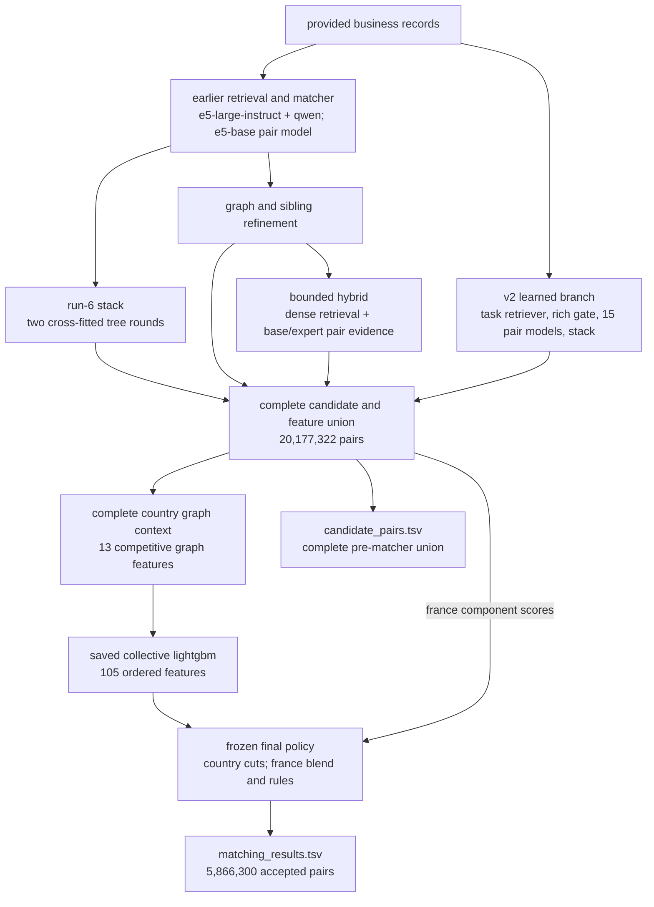
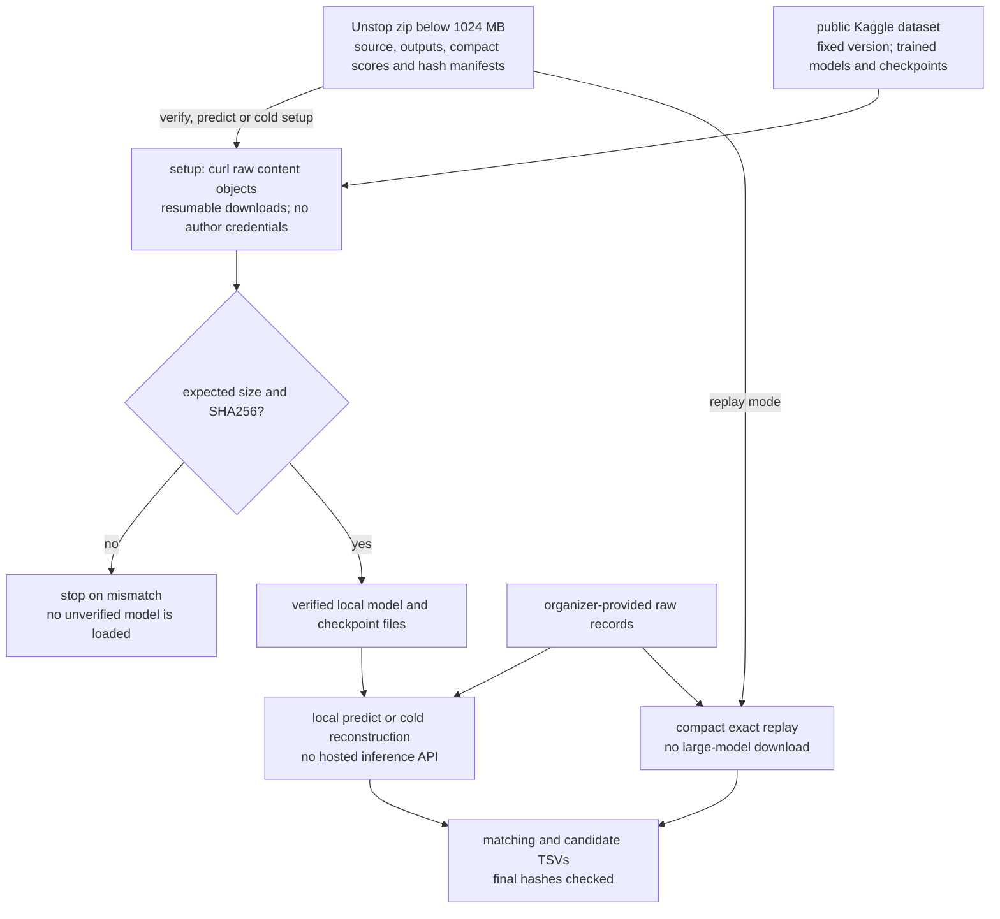

# amazites business entity resolution

our team links noisy business records to a reference business using multilingual retrieval, lexical evidence, learned pair scores and graph context
the final-france Unstop zip stays below 1024 mb and contains the source pipeline, exact submitted outputs, compact replay assets and a checksum-bound model inventory
the 36.7 gb trained-model/checkpoint set is hosted on [Kaggle version 1](https://www.kaggle.com/datasets/cycl0p5/amazites-ml-2026-reproduction-assets/versions/1) and fetched automatically by the reproduction commands
the team-reported public macro f0.5 is **0.990285**
the full inference graph uses **8,786,248,209 neural parameters across 21 distinct checkpoints**
the organizer's **8B limit is per model**; the largest individual checkpoint is **595,776,512 (approximately 0.596B)**
see the [verified full model breakdown and reuse rules](docs/models.md#verified-full-neural-parameter-inventory)

## 1. verify and reproduce the submission

from `code/business_entity_resolution` in the extracted archive:

```sh
uv venv --python 3.11.16 .venv
uv pip sync --python .venv/bin/python requirements.txt
.venv/bin/python src/reproduce.py verify
.venv/bin/python src/reproduce.py predict --data /path/to/dataset --out reproduced
```

`dataset/` must contain the original `train/` and `test/` files
`verify`, `predict` and `cold` automatically fetch missing model files with `curl`, pin the dataset version, and check every SHA256 before loading
the public downloads require internet for first setup and do not require the author's Kaggle credentials
use `bash src/fetch_models.sh` to perform the same verified download explicitly
`predict` loads the fitted final model, rebuilds complete country graph context from the included full feature checkpoint, and applies the fitted final rules
all 20,177,322 regenerated candidate probabilities and both submitted output hashes were checked against the recorded release
the destination must be new

to recompute retrieval, neural scores and every subsequent matching stage from raw records using the included trained weights:

```sh
.venv/bin/python src/reproduce.py cold --data /path/to/dataset \
  --work /scratch/amazites-cold --out reproduced-cold --gpus 4 --threads 48
```

the cold path requires the four-gpu, large-memory execution environment described in [reproduction](docs/reproduce.md)
it loads fixed checkpoints and settings; it does not select new models or refit the final decision policy
the original score-only replay is also available through `src/finish.py`

the archive's `configs/release.json` selects its frozen policy
the final-france variant applies the same policy followed by a narrow positional name rule

## 2. archive layout

```text
Amazites_submission.zip
  output/
    matching_results.tsv
    candidate_pairs.tsv
  code/business_entity_resolution/
    src/
    configs/
    assets/
    docs/
    reproduction_manifest.json
    requirements.txt
    README.md
  Documentation_template.md
  manifest.json
```

the score assets are derived from the supplied challenge records
they contain the complete final candidate pool and the score columns needed for exact replay
the raw challenge dataset is supplied separately
`models/`, `resume/` and `training/` are created locally by the Kaggle fetcher; they are outside the size-limited Unstop zip

## 3. pipeline

```text
provided records
  -> lexical and multilingual candidate retrieval
  -> learned gate and cross-encoder scores
  -> run-6 stack, graph refinement and hybrid evidence
  -> residual fusion and collective graph
  -> country-specific final decisions
  -> french category-swap filter
  -> optional positional groupe filter
  -> matching_results.tsv and candidate_pairs.tsv
```

the candidate file contains all 20,177,322 final pre-matcher pairs, including rejected pairs
it is never reduced to accepted matches

## 4. documentation

| guide | contents |
| --- | --- |
| [architecture](docs/arch.md) | data flow, ownership, models and candidate semantics |
| [q&a and code map](docs/qa.md) | reviewer questions, implemented stages, evidence and limitations |
| [compute and execution](docs/compute.md) | azure machine roles, training matrix, full scoring and reliability design |
| [reproduction](docs/reproduce.md) | exact replay, input fingerprints and output conventions |
| [full pipeline](docs/pipeline.md) | rebuilding upstream retrieval, scores and graph models |
| [models and licenses](docs/models.md) | model identities, roles and upstream notices |
| [results](docs/results.md) | public results, measured scope and variant differences |
| [challenge, eda and research](docs/research.md) | input census, empirical bottlenecks, literature and the decision ledger |

## 5. source and environments

| path | purpose | environment |
| --- | --- | --- |
| `src/reproduce.py` | verified trained-checkpoint and full raw-data inference orchestration | top-level environment plus the stage-specific locks |
| `src/fetch_assets.py`, `src/fetch_models.sh` | automatic pinned Kaggle download and SHA256 verification | python standard library and `curl` |
| `src/heads.py` | prediction using saved run-6, graph, hybrid and collective heads | fusion environment |
| `src/finish.py` | frozen final replay | top-level `requirements.txt` |
| `src/final_tuning/` | country-cut and france-blend selection | `requirements/tuning.txt` |
| `src/er/` | lexical pipeline and run-6 stack | `requirements/run6.txt` |
| `src/neural_v2/` | learned retrieval, pair scoring and neural stack | its `pyproject.toml` and `uv.lock` |
| `src/frozen/` | original source-hash-compatible earlier and learned scoring runtimes | each preserved `pyproject.toml` and `uv.lock` |
| `src/fusion/` | hybrid, graph and collective fusion | its `pyproject.toml` and `uv.lock` |

source and configuration snapshots for earlier experiments are retained for traceability
the execution path for these two releases is specified in [the full-pipeline guide](docs/pipeline.md)

## 6. integrity

- ids retain their original challenge meaning
- each target has at most one accepted reference owner
- every reference has a matching row and a candidate row, including empty rows
- every accepted pair belongs to the complete candidate pool
- input and output fingerprints are checked during replay
- source business identities are never enriched through external lookup services

## 7. how the stages fit together

the first expensive stage is candidate discovery
lexical views retain exact text/number evidence, while multilingual and task-trained retrieval recover noisier aliases
a feature-rich gate then allocates pair-model work without restricting every target to the same small fixed candidate count

independent pair models and stacks provide complementary judgments
the run-6, sibling and bounded hybrid branches retain useful evidence that is not identical to the learned ensemble's score
the full outer score union preserves those candidate sources and explicit missing-score information

the later collective graph is a representation over target-to-target similarities
its owner hypotheses compete with a null state, and bounded cavity updates produce additional features for the final learned pair head
the graph does not manufacture new reference-target pairs

the release policy is a separate, frozen layer
india/us use collective-score cuts; france uses a weighted available-score blend and the recorded rule layers
the separation makes it possible to inspect or reproduce a decision change without pretending a new neural model was trained

## 8. what is inside the package

| area | contents | review purpose |
| --- | --- | --- |
| `output/` | exact submitted matching and candidate tsvs | score and blocking audit |
| `src/finish.py` | consolidated deterministic final replay | reproduce the submitted bytes |
| `src/final_tuning/` | actual country-cut and blend-selection source | inspect how the late policy was chosen |
| integrated model/source trees | retrieval, features, neural training, stacks, graph and hybrid code | inspect and reconstruct score generation |
| `configs/training/` | selected retriever/member configurations | bind model recipes to their recorded identities |
| `configs/collective/` | fitting protocol, selected original policy and conditional model evidence | explain the final collective scorer's training/check scope |
| `configs/execution/` | training allocation and full-scoring coverage records | trace parallel execution and completed populations |
| `assets/` | complete final candidate probabilities and france replay inputs | deterministic cpu replay |
| Kaggle → `models/` | neural weights, tokenizers, base snapshots, gates, tree heads, calibrations and fitted direction rules | complete trained inference dependency set |
| Kaggle → `resume/` | complete scored/feature checkpoints at documented stage boundaries | model-based CPU reconstruction and inspection |
| Kaggle → `training/` | original grouped hard-pair populations and text inputs | reproduce the recorded pair-training recipe |
| `reproduction_manifest.json` | every model/checkpoint file size, hash and origin | full dependency integrity |
| environment files | stage-specific pinned dependencies | distinguish different historical runtimes |
| `docs/` and methodology | detailed design, experiments, results and commands | reviewer navigation |
| `manifest.json` at zip root | file sizes and hashes | package-integrity audit |

the original raw challenge data is provided separately
the model manifest and automatic fetch code are included in the zip; the large dependency files are on the pinned public Kaggle dataset
compact `replay` uses the small score assets already inside the zip and does not download the large models

## 9. which variant should be reviewed

| variant | accepted pairs | reported public macro f0.5 | difference |
| --- | ---: | ---: | --- |
| sprint2 | 5,866,303 | 0.990284 | recorded high-performing release |
| final-france | 5,866,300 | 0.990285 | team-reported final submission; three positional-rule removals |

both use the same 20,177,322-pair candidate file
each archive installs its own active `configs/release.json`
the original source checkout defaults to sprint2 and also includes `configs/final.json`

do not infer that a reported score for one artifact establishes the result for another
the [results guide](docs/results.md) records the public progression and distinguishes it from development, search, candidate-oracle and conditional new-head results

## 10. implementation and evaluation lessons

the early bottleneck was not only final tree tuning
missing-address candidates, insufficient matcher evidence and an overly restrictive gate all mattered
later, france exposed the difference between a strong labeled-country score and the score path actually used in production

we therefore retained complete candidate competition, separated heavy scoring from final decisions, preserved member probabilities, and made model/data/schema identity part of every reusable artifact
the inherited sibling-projection caveat and historical audit reuse are documented explicitly

the source is organized so a reviewer can move from a result to its policy, from the policy to its score input, and from that score to the exact implementation and recorded training/execution configuration

## architecture at a glance

<!-- diagram:pipeline -->


[SVG version](docs/diagrams/pipeline.svg) · [Mermaid source](docs/diagrams/pipeline.mmd)
<!-- /diagram:pipeline -->

## checkpoint delivery at a glance

<!-- diagram:distribution -->


[SVG version](docs/diagrams/distribution.svg) · [Mermaid source](docs/diagrams/distribution.mmd)
<!-- /diagram:distribution -->
