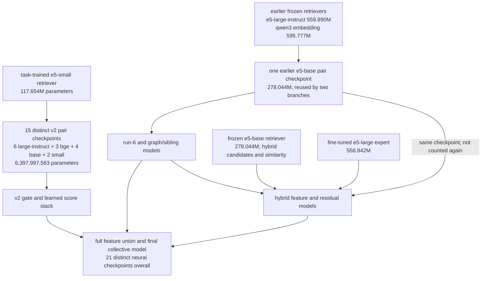

# models and licenses

our final pipeline uses public pretrained sources and task-specific fine-tuned checkpoints
model names retain their exact upstream identifiers
the inventory below records identity and purpose; complete machine-readable provenance remains with the model and scoring configurations

| upstream model | license | role |
| --- | --- | --- |
| `intfloat/multilingual-e5-small` | mit | task-trained retriever and pair-model members |
| `intfloat/multilingual-e5-base` | mit | pair classifiers, frozen hybrid retrieval and hybrid field embeddings |
| `intfloat/multilingual-e5-large-instruct` | mit | earlier retrieval and pair-model members |
| `BAAI/bge-reranker-v2-m3` | apache-2.0 | pair-model members |
| `Qwen/Qwen3-Embedding-0.6B` | apache-2.0 | earlier candidate-retrieval lane |
| `intfloat/multilingual-e5-large` | mit | hybrid neural expert |

lightgbm models are trained from the challenge-derived features and labels
frozen score assets preserve the predictions used by the final decision layer
using recorded scores does not change which upstream models generated them

## verified full neural parameter inventory

the recorded 15-member pair ensemble has **6,397,997,583 parameters (6.398 billion)**:

| fine-tuned member base | members | parameters per member | subtotal |
| --- | ---: | ---: | ---: |
| multilingual-e5-large-instruct | 6 | 558,841,857 | 3,353,051,142 |
| bge-reranker-v2-m3 | 3 | 566,706,177 | 1,700,118,531 |
| multilingual-e5-base | 4 | 277,453,825 | 1,109,815,300 |
| multilingual-e5-small | 2 | 117,506,305 | 235,012,610 |

the remaining inference checkpoints are:

| model/checkpoint | actual role | parameters |
| --- | --- | ---: |
| task-trained multilingual-e5-small | v2 candidate retrieval | 117,653,760 |
| frozen multilingual-e5-base | hybrid dense retrieval and pair similarity | 278,043,648 |
| earlier fine-tuned multilingual-e5-base pair model | earlier matcher, reused for the hybrid `ce_base` feature | 278,044,417 |
| frozen Qwen3-Embedding-0.6B | earlier candidate retrieval | 595,776,512 |
| frozen multilingual-e5-large-instruct | earlier candidate retrieval | 559,890,432 |
| fine-tuned multilingual-e5-large expert | hybrid neural pair feature | 558,841,857 |
| **v2 ensemble + task retriever subtotal** | **selected v2 retrieval/matching path** | **6,515,651,343** |
| **complete neural inference total** | **21 distinct checkpoints** | **8,786,248,209 (8.786B, approximately 8.79B)** |

the expert is 558.842M, not the 559.890M of the frozen large retriever
its fitted pair architecture uses the pooler-free backbone plus a scalar head
the frozen e5-base model belongs to the hybrid dense branch; the earlier candidate retrievers are large-instruct and qwen

### the 8B rule is per model

the organizer clarification states: **the limit is per model**, so every embedder, reranker, matcher or other processing model must independently meet the model-size and license requirements
it is not an aggregate pipeline limit
our largest individual checkpoint is **595,776,512 parameters (approximately 0.596B)**
the **8.786B combined neural total does not violate the stated per-model rule**; all individual checkpoints are below 8B
the original model licenses are MIT or Apache-2.0 as listed above

Kaggle is used only to download checkpoint files during setup
inference loads the verified local files and makes no hosted-model API calls
task-specific fine-tuning uses the provided challenge data

### counting method and reuse

the counts come from the actual safetensors checkpoint headers and are bound to file hashes in [`model-parameters.json`](../configs/model-parameters.json)
frozen parameter tensors are included; optimizer state and non-parameter buffers are not
the frozen e5-base snapshot contains 514 integer position-id buffer elements that are excluded from its parameter count
the task-trained small retriever's 117,653,760 counted elements are parameter tensors

the same earlier pair checkpoint is used in more than one branch and is counted only once
distinct fine-tuned checkpoints are counted separately even when they start from the same pretrained family
training-only initialization snapshots are excluded from the inference total
lightgbm trees, calibration tables, fitted word rules and data/feature matrices are separate non-neural objects, not additional transformer parameter counts

after fetching the assets, recount them locally with:

```sh
python3 src/model_inventory.py
```

## Kaggle-hosted trained artifacts

the checkpoint files are on [Kaggle version 1](https://www.kaggle.com/datasets/cycl0p5/amazites-ml-2026-reproduction-assets/versions/1)
the Unstop zip carries the manifest and `curl`-based automatic fetcher so it stays below 1024 mb
the locations below are restored locally before trained-model inference

| location | role |
| --- | --- |
| `models/earlier/` | the original lexical gate and fitted pair classifier |
| `models/learned/encoder/` | task-trained retrieval weights and tokenizer |
| `models/learned/neural/` | all 15 selected pair-model checkpoints and member metadata |
| `models/learned/gate/`, `reverse/`, `stack/` | rich gate, reverse-index state and selected score stack |
| `models/run6/` | both rounds of cross-fitted tree models and their ordered feature contracts |
| `models/graph-ranker/`, `graph-refine/` | calibrated binary/rank models and sibling heads |
| `models/expert/`, `models/hybrid/` | trained neural expert and bounded hybrid residual heads |
| `models/fusion/`, `models/collective/` | original residual baseline, fitted collective reranker and selection metadata |
| `models/france/rules.json` | fitted category-direction parameters, data identity and fitting-pool hash |
| `models/bases/` | pinned upstream snapshots and tokenizer/pooling support files |

the run-3 artifacts are retained as rule-development provenance; cold inference applies the saved word-direction parameters rather than asking that historical scorer for new predictions
`reproduction_manifest.json` binds every included file to its size, content hash and retained source

## provenance

- neural source identities and revisions: `src/neural_v2/reports/model_sources.json`
- pair-ensemble member fingerprints: `src/neural_v2/reports/final_ensemble_members.json`
- earlier neural runtime: `src/fusion/upstream_neural/`
- hybrid and collective training configurations: `src/fusion/business_entity_resolution/configs/`
- score-producer identifiers and selected columns: `assets/manifest.json`

## notices and primary sources

- [e5 license notice](../src/neural_v2/licenses/e5-mit.txt)
- [apache-2.0 license text](../src/neural_v2/licenses/qwen3-apache-2.0.txt)
- [multilingual e5](https://huggingface.co/intfloat/multilingual-e5-base)
- [multilingual e5 instruction model](https://huggingface.co/intfloat/multilingual-e5-large-instruct)
- [bge reranker](https://huggingface.co/BAAI/bge-reranker-v2-m3)
- [qwen embedding model](https://huggingface.co/Qwen/Qwen3-Embedding-0.6B)
- [lightgbm](https://github.com/microsoft/LightGBM)

upstream license texts retain their original wording
the software environments separately record the licenses and versions of supporting libraries

## model roles are separate contracts

an upstream model id does not imply one interchangeable checkpoint
the same family can appear as a frozen retriever, a task-trained retriever, a jointly tokenized pair classifier or a field encoder
their training state, serialization, pooling and feature roles differ

| use | serialization / representation | learned from challenge labels |
| --- | --- | --- |
| task-trained e5-small retrieval | symmetric `query: name | address`, mean pool, normalized vectors | yes, recorded fold-2 positive/hard-pair training |
| earlier frozen retrieval | model-specific name/address/query views | frozen upstream sources |
| learned cross-encoder members | joint reference/target name, address and country text | yes, fixed hard-pair populations |
| hybrid field embeddings | separate name and address views with symmetric query prefix | pinned embedding source for that lane |
| hybrid neural expert | the retained pair-model configuration and tokenizer | recorded expert training pipeline |
| tree, graph and fusion heads | ordered challenge-derived numeric/text/score features | yes, their documented reference/owner-group protocols |

the task-trained small retrieval bundle must not be loaded as if it were the untouched public checkpoint
similarly, the earlier pair classifier and the newer mean-pooled ensemble members remain distinct artifacts even when they share an upstream model family

## selected learned ensemble

the selected member order is part of the score schema:

```text
m0  large21      m5  large160b   m10 base21
m1  large41      m6  bge51       m11 base160
m2  large51      m7  bge131      m12 base160b
m3  large160     m8  bge160      m13 small21
m4  large96      m9  base71      m14 small71
```

`np_m0` through `np_m14` are probabilities from those members
the ensemble applies mean-logit aggregation and records per-member evaluation/fallback behavior
the subsequent rich stack may use member logits individually

the selected configurations are in [`configs/training/members.json`](../configs/training/members.json)
the `bge21` periodic checkpoint is retained as an interrupted experiment and is not a selected scoring member
the [compute guide](compute.md) maps member names to seed, learning rate, sequence length and batch comparison

## tree and graph heads

the pipeline contains several learned tree roles, each fitted on a specific feature contract:

- the dense/name-aware gate allocates candidate scoring
- the rich learned stack combines text/corpus features with gate, neural and member logits
- the run-6 stack uses cross-fitted rounds and confident-sibling evidence
- the graph/sibling branch supplies a learned `head` score
- the bounded hybrid fits weighted residual logits around its parent
- residual fusion learns corrections around the newest stack
- the collective model consumes the full fusion feature set plus deterministic graph features

the selected collective backend is lightgbm
the xgboost/catboost contextual mixture is a separate experimental mode
the graph representation itself is deterministic message passing rather than a separately trained neural graph network

## experimental implementations in the source tree

the source archive preserves unpromoted experiments as well as the final execution path
examples include learned edit channels, larger reranker experiments, alternative decoder/calibration policies and contextual booster mixtures

their presence in the source tree does not mean their outputs were used in the released score lineage
the selected model/member records, score-input manifest and [full-pipeline stage map](pipeline.md) identify the actual final inputs
the [results ledger](results.md) describes which comparisons established gains and which did not

## what must accompany a reused checkpoint

for neural models, retain the model and tokenizer files, base identity/revision, serialization, pooling/head definition, input length and file hashes
for gates and tree heads, retain the exact feature order, normalization state, model text, fitting protocol and calibration/decision metadata
for transductive graph/fusion features, retain the complete population and candidate-score inputs used to construct context

the release keeps original machine-readable model records accurate
the written documentation describes the model identities and their roles, while exact replay binds to the resulting score files
recorded scores are not anonymous evidence: their producing model lineage remains part of the submission

## neural checkpoint reuse map

<!-- diagram:neural-models -->


[SVG version](diagrams/neural-models.svg) · [Mermaid source](diagrams/neural-models.mmd)
<!-- /diagram:neural-models -->
